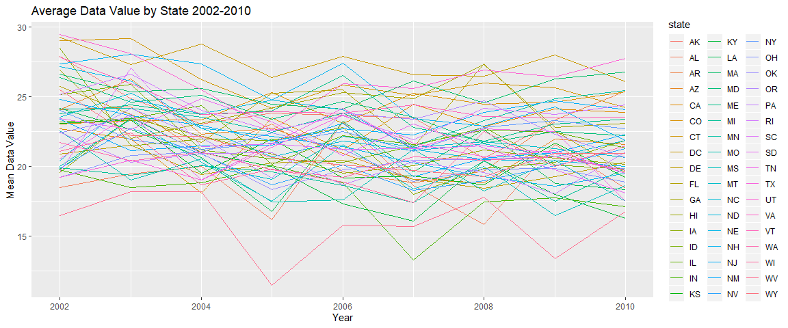
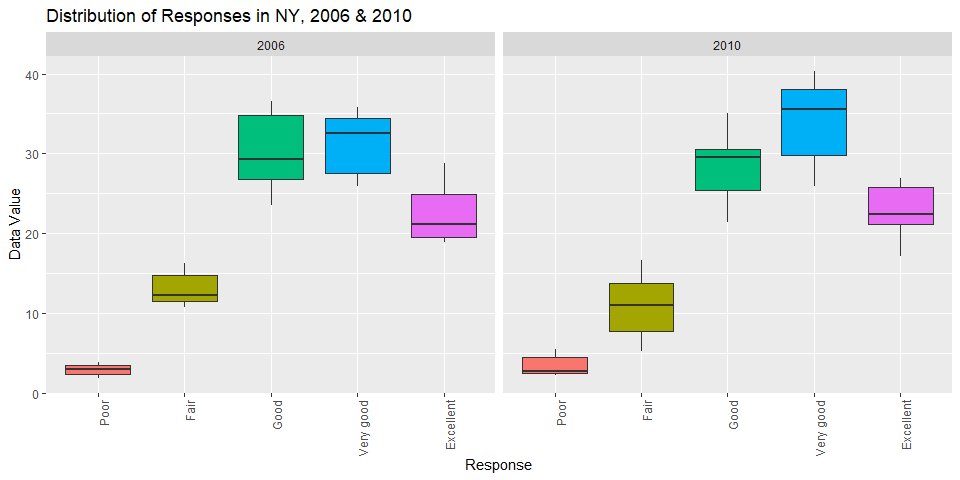

P8105 Homework 3
================
Alison Elgass

    ## -- Attaching packages ----------------------- tidyverse 1.2.1 --

    ## v ggplot2 3.2.1     v purrr   0.3.2
    ## v tibble  2.1.3     v dplyr   0.8.3
    ## v tidyr   1.0.0     v stringr 1.4.0
    ## v readr   1.3.1     v forcats 0.4.0

    ## -- Conflicts -------------------------- tidyverse_conflicts() --
    ## x dplyr::filter() masks stats::filter()
    ## x dplyr::lag()    masks stats::lag()

    ## 
    ## Attaching package: 'ggridges'

    ## The following object is masked from 'package:ggplot2':
    ## 
    ##     scale_discrete_manual

# Problem 1

First we load in the instacart data.

``` r
data("instacart")
```

This dataset represents a (non-random) sample of Instacart online
grocery orders from 2017. The dataset has 1384617 rows, each of which
represents one product from a specific order of a unique shopper. The
data has 15 columns which give information about the specific item in
each row. The variables `order_id`, `product_id`, and `user_id` identify
the specific order number, product, and shopper, respectively. The
variable `reordered` indicates if the shopper has previously ordered
that item, in which case `reordered = 1`, otherwise `reordered = 0`.
`order_number` indicates how many orders this shopper has made. Taking
order \#1 as an example, `order_number = 4` means that this shopper has
made three orders in the past and this is their fourth. The variables
`product_name` is self explanatory, and the variables `aisle`/`aisle_id`
and `department`/`department_id` indicate where to find that product in
the Instacart online market.

## Dang these Virtual Aisles are Crowded

``` r
#create a tibble with top aisles, sorted by # items
aisles_ranked = instacart %>%  
  count(aisle, sort = TRUE, name = "n_items")

head(aisles_ranked) #display top few
```

    ## # A tibble: 6 x 2
    ##   aisle                         n_items
    ##   <chr>                           <int>
    ## 1 fresh vegetables               150609
    ## 2 fresh fruits                   150473
    ## 3 packaged vegetables fruits      78493
    ## 4 yogurt                          55240
    ## 5 packaged cheese                 41699
    ## 6 water seltzer sparkling water   36617

We created the tibble `aisles_ranked` (above) to explore the most
popular aisles from the dataset. There are 134 different aisles in
total, with the top six most popular shown above.

``` r
#now make a plot of popular aisles
aisles_ranked %>% 
  filter(n_items > 10000) %>% 
  ggplot(aes(x = reorder(aisle,-n_items), y = n_items,
             fill = aisle)) +
  geom_bar(stat = "identity") +
  ggtitle("Most Popular Instacart Shopping Aisles") +
  xlab("Aisle Name") + ylab("Number of Items Ordered") +
  theme(legend.position = "none",
        axis.text.x = element_text(angle = 90, hjust = 1))
```

<!-- -->

Here we see a graph of the most popular aisles that have at least 10,000
orders. Just as we saw in our tibble, fresh vegetables and fresh fruits
are by far the most popular aisles, with over 150,000 orders each.
LaCroix lovers rejoice as sparkling water comes in hot at \#6.
Interestingly, soy & lactose free also makes the list as the \#9 aisle
overall.

## If You Like Baking or Dogs or Produce

Next let’s look at the top 3 most popular items in the following
categories: baking ingredients, dog food, and packaged fruit &
vegetables.

``` r
#Sort baking aisle by count of items, then take top 3
baking_top3 = instacart %>% 
  filter(aisle == "baking ingredients") %>% 
  count(product_name, sort = TRUE) %>% 
  rename("Top Baking Items" = "product_name") %>% 
  slice(1:3)

#Do the same for dog & packaged fruit/veg aisles
dog_top3 = instacart %>% 
  filter(aisle == "dog food care") %>% 
  count(product_name, sort = TRUE) %>% 
  rename("Top Dog Food Care Items" = "product_name") %>% 
  slice(1:3)

pvf_top3 = instacart %>% 
  filter(aisle == "packaged vegetables fruits") %>% 
  count(product_name, sort = TRUE) %>% 
  rename("Top Packaged Veggies & Fruit" = "product_name") %>% 
  slice(1:3)

#now combine them all into 1 pretty table
cbind(baking_top3, dog_top3, pvf_top3) %>% 
  knitr::kable(caption = "Most Purchased Items 
               from 3 Select Aisles")
```

| Top Baking Items  |   n | Top Dog Food Care Items                       |  n | Top Packaged Veggies & Fruit |    n |
| :---------------- | --: | :-------------------------------------------- | -: | :--------------------------- | ---: |
| Light Brown Sugar | 499 | Snack Sticks Chicken & Rice Recipe Dog Treats | 30 | Organic Baby Spinach         | 9784 |
| Pure Baking Soda  | 387 | Organix Chicken & Brown Rice Recipe           | 28 | Organic Raspberries          | 5546 |
| Cane Sugar        | 336 | Small Dog Biscuits                            | 26 | Organic Blueberries          | 4966 |

Most Purchased Items from 3 Select Aisles

This table is pretty self explanatory. Hopefully, though, nobody is
trying to make a cake with just brown sugar, baking soda, and cane
(white) sugar. Also props to the healthy eaters out there buying spinach
and berries. Hooray for antioxidants.

## Ice Cream \>\> Apples (at any time of the day)

Finally we make a table showing the average time of purchase for two
items, pink lady apples and coffee ice cream, sorted by the day of the
week they were purchased.

``` r
#Find pink lady apple rows, group by day, find mean time
apples_all = instacart %>% 
  filter(product_name == "Pink Lady Apples") %>% 
  arrange(order_dow) %>%  #arrange for clarity
  group_by(order_dow) %>% #group by day of week
  mutate(        #take mean order time within each dow
    mean_time = mean(order_hour_of_day)
  ) %>% 
  select(product_name, order_dow, mean_time) #relevant 3

#Find coffee ice cream rows, group by day, find mean time
coffee_all = instacart %>% 
  filter(product_name == "Coffee Ice Cream") %>% 
  arrange(order_dow) %>%  #arrange for clarity
  group_by(order_dow) %>% #group by day of week
  mutate(        #take mean order time within each dow
    mean_time = mean(order_hour_of_day)
  ) %>% 
  select(product_name, order_dow, mean_time) #relevant 3

#Now take 7 unique rows in each (1 for each day of week)
#then put the two 7x3 tables together, pivot to wide
rbind(distinct(apples_all), distinct(coffee_all)) %>% 
  pivot_wider(
    names_from = order_dow,
    values_from = mean_time,
    names_prefix = "Day "
  ) %>% 
  rename("Product" = "product_name") %>% 
  knitr::kable(caption = "Average Hour of Purchase by Day for Pink Lady Apples & Coffee Ice Cream")
```

| Product          |    Day 0 |    Day 1 |    Day 2 |    Day 3 |    Day 4 |    Day 5 |    Day 6 |
| :--------------- | -------: | -------: | -------: | -------: | -------: | -------: | -------: |
| Pink Lady Apples | 13.44118 | 11.36000 | 11.70213 | 14.25000 | 11.55172 | 12.78431 | 11.93750 |
| Coffee Ice Cream | 13.77419 | 14.31579 | 15.38095 | 15.31818 | 15.21739 | 12.26316 | 13.83333 |

Average Hour of Purchase by Day for Pink Lady Apples & Coffee Ice Cream

Overall it seems like people tend to buy pink lady apples slightly
earlier in the day than coffee ice cream; the mean hour of purchase for
the apples ranges approximately from 11-14 (11:00 AM - 2:00 PM), while
the mean for the ice cream ranges from 12-15 (12:00 - 3:00 PM).

# Problem 2

First we load in and tidy the BRFSS data.

``` r
data("brfss_smart2010")
  
#create variable brfss_health with only 'overall health'
brfss_health = brfss_smart2010 %>% 
  janitor::clean_names() %>%
  rename("state" = "locationabbr",
         "county" = "locationdesc") %>% 
  filter(topic == "Overall Health") %>% #only this topic 
  mutate(   #convert to ordered factor
    response = factor(response, 
                         c("Poor", "Fair", "Good",
                           "Very good", "Excellent"))
  )

str(pull(brfss_health,response)) #check factor levels
```

    ##  Factor w/ 5 levels "Poor","Fair",..: 5 4 3 2 1 5 4 3 2 1 ...

## States with Observations in 7+ Counties

``` r
brfss_health %>% 
  filter(year == 2002) %>%   #data from 2002
  group_by(state) %>%        #group into states
  summarize(  #tally numb of unique counties in each state
    n_counties = n_distinct(county)
  ) %>% 
  filter(n_counties >= 7)   #only those with 7+
```

    ## # A tibble: 6 x 2
    ##   state n_counties
    ##   <chr>      <int>
    ## 1 CT             7
    ## 2 FL             7
    ## 3 MA             8
    ## 4 NC             7
    ## 5 NJ             8
    ## 6 PA            10

In 2002, we conclude that Connecticut, Florida, Massachusetts, North
Carolina, New Jersey, and Pennsylvania had observations taken from 7 or
more counties.

## Spaghetti Plot of “Excellent” Values

``` r
brfss_health %>% 
  filter(response == "Excellent") %>% 
  group_by(state, year) %>% 
  mutate(  #create variable for mean val by state, year
    avg_value_by_state = mean(data_value, na.rm = TRUE)
  ) %>%               
  #now select only 3 relevant columns
  select(year, state, avg_value_by_state) %>%
  distinct() %>%  #remove duplicate rows
  #plot it!
  ggplot(aes(x = year, y = avg_value_by_state)) + 
  geom_line(aes(group = state, color = state)) +
  ggtitle("Average Data Value by State 2002-2010") +
  xlab("Year") + ylab("Mean Data Value")
```

<!-- -->

This plot shows the mean of the variable `data_value` aggregated across
all the counties in a state, from the years 2002-2010. We see most
values are clustered between 17 and 28, approximately. Overall the
trends don’t seem to have a particular pattern. Some states have large
spikes up or down but for the most part they look random.

### Boxplot for Response Values in NY

``` r
brfss_health %>%
  filter(state == "NY",  #only NY locations, 2006 & 2010
         year %in% c(2006, 2010)) %>% 
  #now make a boxplot of data_value for each response level
  ggplot(aes(x = response, y = data_value, 
             fill = response)) +
  geom_boxplot() +
  facet_grid(~year) + #2 panels: 2006 and 2010 
  
  ggtitle("Distribution of Responses in NY, 2006 & 2010") +
  xlab("Response") + ylab("Data Value") +
  theme(legend.position = "none",
        axis.text.x = element_text(angle = 90, hjust = 1))
```

<!-- -->

This plot shows us the distribution of the variable `data_value` for
each response category (poor - excellent) across all NY counties
surveyed, in both 2006 and 2010. In both years, the distribution of
“poor” responses has the narrowest range of values. Another similarity
between 2006 and 2010 is that the median data values and their
respective IQR’s increase as the quality of life response increases from
“poor” to “very good,” with the biggest leap occuring between “fair” and
“good.” The box corresponding to the “very good” category is slightly
higher in 2010 than in 2006, with a median value just above 35 in 2006
versus a median of about 33 in 2006.  
In both 2006 and 2010, the “excellent” category has a significantly
lower distribution of values compared to the two categories beneath it–
“good” and “very good.” In 2006 the median value of the “excellent
category is roughly 21, which is 12 points lower than the median of”very
good" at 33. In 2010 the median value of the “excellent category is
about 22, which is 14 points lower than the median of”very good" at 36.

# Problem 3

As usual we start by loading & tidying the accelerometer data (located
in the local hw3 data folder).

``` r
acceler_data = 
  read_csv(file = "./hw3 data/accel_data.csv") %>% 
  pivot_longer(  #convert to long format
    activity.1:activity.1440,
    names_to = "minute",         #rename minute column
    names_prefix = "activity.",  #remove prefixes
    values_to = "activity_count" #rename count column
  ) %>% 
  mutate(   #create weekend/weekday variable
    day_type = if_else(day %in% c("Saturday","Sunday"),
                       "Weekend", "Weekday"),
    minute = as.numeric(minute) #make minute a numeric var
  )
```

    ## Parsed with column specification:
    ## cols(
    ##   .default = col_double(),
    ##   day = col_character()
    ## )

    ## See spec(...) for full column specifications.

``` r
head(acceler_data)
```

    ## # A tibble: 6 x 6
    ##    week day_id day    minute activity_count day_type
    ##   <dbl>  <dbl> <chr>   <dbl>          <dbl> <chr>   
    ## 1     1      1 Friday      1           88.4 Weekday 
    ## 2     1      1 Friday      2           82.2 Weekday 
    ## 3     1      1 Friday      3           64.4 Weekday 
    ## 4     1      1 Friday      4           70.0 Weekday 
    ## 5     1      1 Friday      5           75.0 Weekday 
    ## 6     1      1 Friday      6           66.3 Weekday

This dataset gives the activity count as measured by the accelerometer
for every minute over a 5 week period. We converted the original dataset
from wide to long format, so that each row corresponds to one minute of
measurement, with variables indicating the corresponding week number out
of 5, day number out of 35, and day of the week along with a new
variable `day_type` indicating if the day is a weekday or weekend. The
variable of interest `activity_count` gives the accelerometer’s reading
for that specific minute. Consequently, the final tidy dataset
`acceler_data` has 50400 rows, which is equal to 35 days x 24 hours x 60
minutes.

## Total Activity Per Day

``` r
#use groupby/summarize to show total activity by day
acceler_data %>% 
  group_by(day_id) %>% 
  summarize(  #create variable for total activity per day
    total_activity = sum(activity_count)
  ) %>% 
  knitr::kable(caption = "Total Activity Count Per Day")
```

| day\_id | total\_activity |
| ------: | --------------: |
|       1 |       480542.62 |
|       2 |        78828.07 |
|       3 |       376254.00 |
|       4 |       631105.00 |
|       5 |       355923.64 |
|       6 |       307094.24 |
|       7 |       340115.01 |
|       8 |       568839.00 |
|       9 |       295431.00 |
|      10 |       607175.00 |
|      11 |       422018.00 |
|      12 |       474048.00 |
|      13 |       423245.00 |
|      14 |       440962.00 |
|      15 |       467420.00 |
|      16 |       685910.00 |
|      17 |       382928.00 |
|      18 |       467052.00 |
|      19 |       371230.00 |
|      20 |       381507.00 |
|      21 |       468869.00 |
|      22 |       154049.00 |
|      23 |       409450.00 |
|      24 |         1440.00 |
|      25 |       260617.00 |
|      26 |       340291.00 |
|      27 |       319568.00 |
|      28 |       434460.00 |
|      29 |       620860.00 |
|      30 |       389080.00 |
|      31 |         1440.00 |
|      32 |       138421.00 |
|      33 |       549658.00 |
|      34 |       367824.00 |
|      35 |       445366.00 |

Total Activity Count Per Day

``` r
#now do the same process but make a line plot
acceler_data %>% 
  group_by(day_id) %>% 
  summarize(
    total_activity = sum(activity_count),
    day_type = min(day_type) #cheat to keep this variable
  ) %>% 
  #line plot of day vs. total count over the 35 days
  ggplot(aes(x = day_id, y = total_activity)) +
  geom_line() +  
  geom_point(aes(color = day_type)) + #color for 
                                      #weekday vs. weekend
  scale_x_continuous(
    breaks = seq(0, 35, 5)
    ) +
  labs(
    title = "Total Activity Trend Over 5 Weeks", 
    x = "Day Number", 
    y = "Total Activity Count"
  ) +
  theme(plot.title = element_text(hjust = 0.5))
```

<!-- -->

The total activity count per day does not have a clear overall trend; it
spikes and dips frequently with local highs and lows occurring every 2
days or so. The maximum total activity in one day occurrs on day 16,
which is a Monday, with a total activity count of 685,910. The lowest
activity totals occurr on days 24 and 31, both of which are Saturdays,
each with a total count of 1,440. Based on this finding, I thought that
perhaps weekends would have lower total activity compared to weekdays.
However once I added color to distinguish weekdays vs. weekends, this
hypothesis does not seem supported by the data.

## Graph of Activity Levels by Day

``` r
acceler_data %>% 
  #group_by(day_id) %>% #or day???
  ggplot(aes(x = minute, y = activity_count)) +
  geom_line(aes(group = day, color = day)) +
  scale_x_continuous(
    breaks = seq(0, 1500, 100)
    ) +
  labs(
    title = "Activity Levels by Day", 
    x = "Minute", 
    y = "Activity Count"
  ) +
  theme(plot.title = element_text(hjust = 0.5))
```

<!-- -->

Again there is not one clear pattern here, but we do see some trends
over the course of the 24 hour period. Activity is generally pretty low
before minute 300 or so, which corresponds to 5:00 AM. This makes sense
as the subject is likely asleep. We see increased activity with many
spikes from minutes 350-750 (5:30 AM - 12:30 PM), followed by decreased
activity until about minute 950 (shortly before 4:00 PM). The period
with the highest activity levels occurrs definitively from minutes
1150-1300, or approximately 7:00- 9:30 PM in the evening. This is
followed again by a period of very low activity, presumably for sleep.  
It’s difficult to distinguish clear differences based on days of the
week. Generally the periods of high and low activity seem to be similar
among all days, although there is a good amount of variation. This is
likely due to the semi-random nature that comes with monitoring activity
in a minute-by-minute fashion. For example, we can’t expect minute 647
on Tuesday to have the exact same activity output as minute 647 on
Wednesday, even if the subject’s routine is consistent between days.
